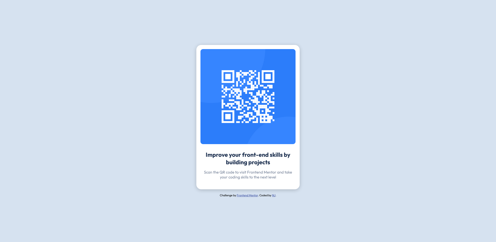

# Frontend Mentor - QR code component solution

This is a solution to the [QR code component challenge on Frontend Mentor](https://www.frontendmentor.io/challenges/qr-code-component-iux_sIO_H). Frontend Mentor challenges help you improve your coding skills by building realistic projects.

## Table of contents

- [Frontend Mentor - QR code component solution](#frontend-mentor---qr-code-component-solution)
  - [Table of contents](#table-of-contents)
  - [Overview](#overview)
    - [Screenshot](#screenshot)
    - [Links](#links)
  - [My process](#my-process)
    - [Built with](#built-with)
    - [What I learned](#what-i-learned)
    - [Continued development](#continued-development)
    - [Useful resources](#useful-resources)
  - [Author](#author)
  - [Acknowledgments](#acknowledgments)

## Overview

### Screenshot


### Links

- Solution URL: [GitHub](https://github.com/eucarizan/fem-qr-code-component)
- Live Site URL: [GitHub Pages](https://eucarizan.github.io/fem-qr-code-component/)

## My process

### Built with
- Semantic HTML5 markup
- CSS custom properties
- Flexbox

**Note: These are just examples. Delete this note and replace the list above with your own choices**

### What I learned
- CCS @import Rule
```css
@import url('https://fonts.googleapis.com/css2?family=Outfit:wght@400;700&display=swap');
```
- CSS :root selector for some declarations
```css
:root {
    --white: hsl(0, 0%, 100%);
    --light-gray: hsl(212, 45%, 89%);
    --grayish-blue: hsl(220, 15%, 55%);
    --dark-blue: hsl(218, 44%, 22%);
}
```

### Continued development
I will work on:
- Responsive Web Design

### Useful resources
- [TsbSankara](https://www.youtube.com/watch?v=JFyMWwOxHYM) - I watched this for referrence

## Author
- Frontend Mentor - [@eucarizan](https://www.frontendmentor.io/profile/eucarizan)

## Acknowledgments
Thanks to [@Pam](https://github.com/pamdgjasme) for helping me
